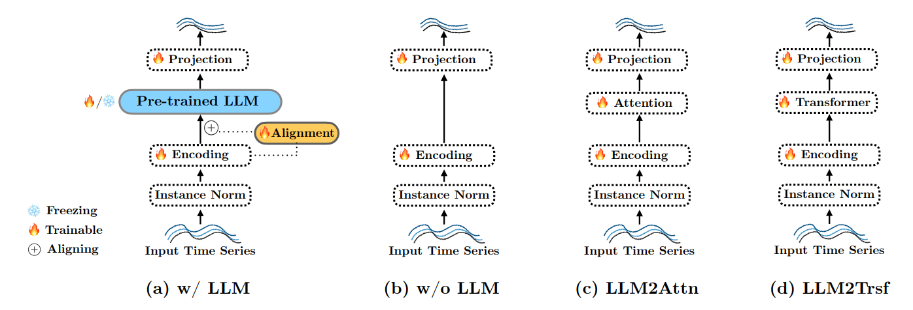

# Are Language Models Actually Useful for Time Series Forecasting?

**Year:** 2024

**Paper:** [arXiv](https://arxiv.org/pdf/2406.16964)

**Code:** [GitHub](https://github.com/BennyTMT/LLMsForTimeSeries)

## ✏️ Summary

**Key findings:**

1. Ablation results show that removing or replacing LLMs with simpler components like attention and transformer yields comparable or better performance, indicating pretrained LLMs do not contribute to time series forecasting.

2. The computational intensity of LLMs during both training and inference in time series forecasting tasks does not result in a corresponding performance improvement.

3. Pretraining with language datasets is unnecessary for time series forecasting, as textual knowledge provides very limited aids for time series.

4. LLM-based methods show no greater sensitivity to input shuffling than ablations, indicating LLMs do not have unique capabilities for representing sequential dependencies in time series.

5. Ablation models can outperform LLMs even in few-shot forecasting scenarios.

6. For time series forecasing, patching combined with attention or transformer layers is a simple and effective approach.

In conclusion, although language models excel at capturing sequential dependencies in text, they currently do not generalize well to time series data.

## 🏷️ Topics
`LLM`
