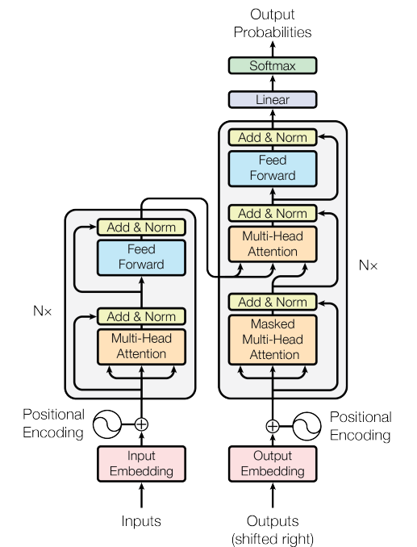

# Attention Is All You Need

**Year:** 2017

**Published by:** Google

**Paper:** [arXiv](https://arxiv.org/pdf/1706.03762)

**Code:** [GitHub](https://github.com/tensorflow/tensor2tensor)

## ✏️ Summary
RNNs capture long dependencies but are sequential, while CNNs are parallel but struggle with distant relations. Transformer, based solely on attention, is both parallel and can attend to distant positions.

**Architecture**

* Scaled Dot-Product Attention: Multiplicative attention (faster than additive) with a scaling factor to prevent small gradients.

* Multi-Head Attention: Multiple projections of queries/keys/values, parallel attention and concatenation, allowing the model to capture information from different representation subspaces.

* Encoder: Stack of layers with multi-head **self-attention** and FFN, with residual connections.

* Decoder: Stack of layers with **masked** multi-head **self-attention**, encoder–decoder **attention** and FFN, with residual connections.

* Embeddings and Softmax: Token representations and next-token probabilities.

* Positional Encoding: Order information in both encoder and decoder.

**Advantages**

* Low computational complexity per layer
* High parallelism
* Short path length between distant positions

## 🏷️ Topics
`LLM`
