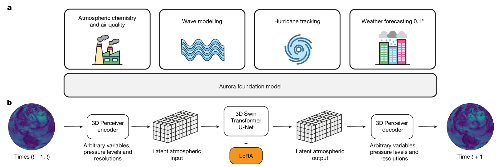

# Aurora: A foundation model for the Earth system

**Year:** 2025

**Published by:** Microsoft

**Paper:** [Nature](https://www.nature.com/articles/s41586-025-09005-y)

**Code:** [GitHub](https://github.com/microsoft/aurora)

## ✏️ Summary
The model consists of three main components:

- **Encoder**: Converts heterogeneous weather inputs into a 3D latent representation across height, latitude, and longitude. Static inputs are included as additional surface-level variables. The encoder also adds Fourier-based encodings.
- **Processor**: Learns how Earth’s atmosphere evolves over time using a **3D Swin Transformer**, which:
    
    – Splits data into small spatial patches.
    
    – Applies local self-attention within each patch.
    
    – Shifts windows between layers to enable communication across neighboring regions.
    
- **Decoder**: Translates the latent 3D representation back into physical weather predictions.

Forecasts over multiple lead times are produced by recursively feeding the model’s outputs as inputs for the next step. The model is trained with a MAE loss, weighted across variables.

## 🏷️ Topics
`FM`
