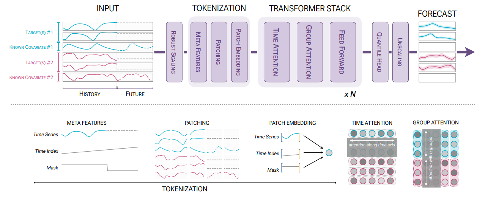

# Chronos-2: From Univariate to Universal Forecasting

**Year:** 2025

**Published by:** Amazon

**Paper:** [arXiv](https://arxiv.org/pdf/2510.15821)

**Code:** [GitHub](https://github.com/amazon-science/chronos-forecasting)

## ✏️ Summary

Chronos-2 is a time-series foundation model designed to handle univariate and multivariate forecasting, with past and future covariates.

**Inputs:** Numerical and categorical features

**Preprocessing:**
- **Scaling:** standardization followed by a `sinh` transformation
- **Meta-features:** (1) positional encoding, (2) masks for missing values and for future timestamps of past-only covariates

**Representation:**
- **Patching:** all features with meta-features are split into patches.
- A special `REG` token separates past and future context.
- **Embedding:** patches embedded via a residual network.

**Architecture:**
- Encoder-only Transformer similar to T5.
- **Time attention:** self-attention with rotary positional embeddings used to share information across univariate feature.
- **Group attention:** used to share information across set of features across the batch axis. Related features are marked with common group ID.

**Output:** Quantile forecasting head with 21 quantiles

**Training steps:**
- Short histories and short horizons
- Longer histories and longer horizons

**Inference:** Supports many forecasting tasks (univariate/multivariate/covariates), with the task implicitly determined by group IDs and the availability of future covariates.

**Data:** Synthetic data perform nearly as well as real data.

## 🏷️ Topics
`Covariates`, `FM`, `Patching`, `Probabilistic`
