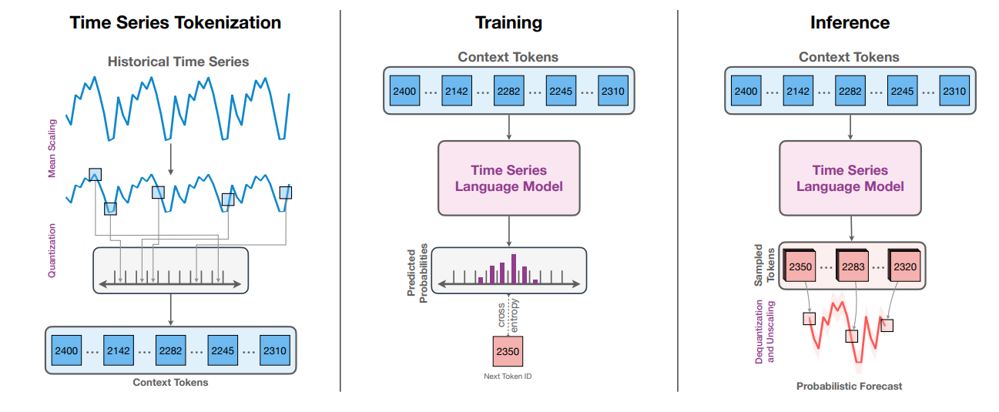

# Chronos: Learning the Language of Time Series

**Year:** 2024

**Published by:** Amazon

**Paper:** [arXiv](https://arxiv.org/pdf/2403.07815)

**Code:** [GitHub](https://github.com/amazon-science/chronos-forecasting)

## ✏️ Summary
Chronos is a probabilistic model for univariate time series forecasting. It’s trained as a language model on tokenized time series data, thereby performing regression via classification.

**Preprocessing:**

- **Scaling:** per-window normalization using mean, standard or min-max scaling.
- **Quantization:** quantizing values into discrete bins using either uniform or data-dependent binning strategies.
- **Special tokens:** *PAD* pads time series to a fixed length and fills in missing values. *EOS* marks the end of each sequence, which is optional for time series, but useful for compatibility with language models.

**Architecture:** LLM-style decoder-only transformers trained on a fixed vocabulary.

**Objective:** cross-entropy loss over discrete tokens (not distance-aware objectives, so adjacent bins aren't considered closer).

**Inference:** the model autoregressively samples tokens, which are then mapped back to numeric values to generate multiple future sequences, forming a predictive distribution by design.

**Data augmentations:**

- **TSMixup:** creates convex combinations of random real series from various datasets.
- **KernelSynth:** generates synthetic series by composing random Gaussian Process kernels.

## 🏷️ Topics
`FM`, `LLM`, `Probabilistic`
