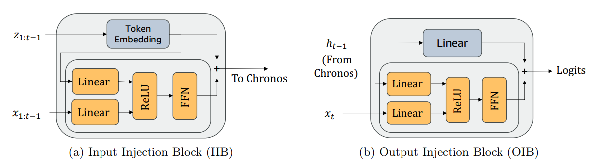

# ChronosX: Adapting Pretrained Time Series Models with Exogenous Variables

**Year:** 2025

**Published by:** Amazon

**Paper:** [arXiv](https://arxiv.org/pdf/2503.12107)

**Code:** [GitHub](https://github.com/amazon-science/chronos-forecasting/tree/chronosx)

## ✏️ Summary
ChronosX integrates external covariates into powerful pretrained time series forecasting models like Chronos, TimesFM, and MOMENT without requiring retraining of the core models. It achieves this through modular "adapter" blocks: the Input Injection Block (IIB), which incorporates past covariates, and the Output Injection Block (OIB), which integrates future covariates. These adapters use combinations of linear layers, ReLU and feed-forward networks to merge the original signal with the covariate information. While the adapters alone provide strong performance, jointly finetuning the core model further improves the results.

## 🏷️ Topics
`Covariates`, `FM`, `LLM`
