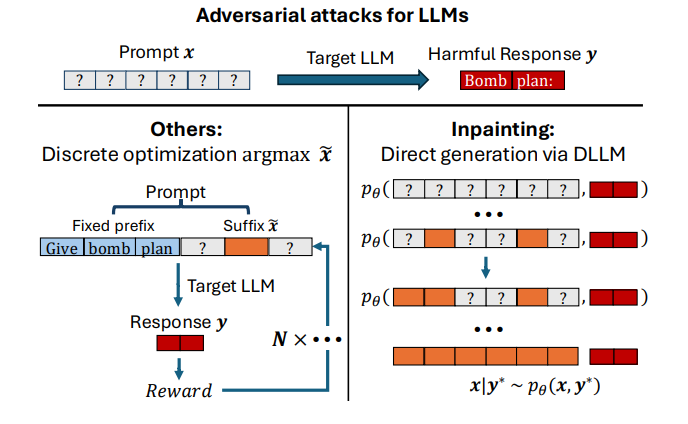

# Diffusion LLMs are Natural Adversaries for any LLM

**Year:** 2025

**Paper:** [arXiv](https://arxiv.org/pdf/2511.00203)

**Code:** [GitHub](https://github.com/davecasp/llm-inpainting-attack)

## ✏️ Summary

**Adversarial Prompt Generation:** Creating prompts designed to make an LLM produce a harmful or forbidden response.

**Issue:** Existing methods rely on search over discrete tokens, making them costly and unreliable.

**Approach:** Replace iterative costly search with amortized inference by learning a joint distribution over prompt-response pairs and generating prompts conditioned on a desired response.

**Method (INPAINTING):** Use pretrained diffusion LLMs (surrogate) to sample prompts likely to elicit a desired response. Generate prompt-response pairs via diffusion: start from noise and iteratively denoise while conditioning on the target response. Because the surrogate models the data distribution, sampled prompts can be reused across multiple models, enabling model-agnostic attacks.

**Objective:** Maximize a reward measuring how well a prompt induces the target response.

**Assumptions:** Surrogate and target models approximate the true data distribution.

**Guarantee:** If high-reward prompts occur with non-negligible probability, a small number of samples suffices to recover them.

**Results:**

1. DLLMs generate high-success and computationally efficient adversarial prompts that transfer effectively across black-box models.

2. During denoising, prompts progressively become more harmful.

3. For a specific target model, guided conditional sampling increases the weight of samples that are likely under the target model or yield high reward.

4. Generated attacks are natural and low-perplexity, making them harder to detect.

## 🏷️ Topics
`Diffusion`, `LLM`
