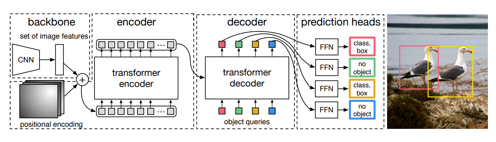

# End-to-End Object Detection with Transformers

**Year:** 2020

**Published by:** Meta

**Paper:** [arXiv](https://arxiv.org/pdf/2005.12872)

**Code:** [GitHub](https://github.com/facebookresearch/detr)

## ✏️ Summary

Current object detectors rely on proposals or anchors followed by post-processing, while DETR removes these hand-designed components and formulates detection as direct set prediction.

### Object detection set prediction loss

DETR outputs a fixed set of N predictions, most of which may be "no object". During training, it first uses Hungarian matching to assign each ground-truth object to exactly one prediction based on class score and box similarity. After matching, DETR computes the loss: classification loss for all predictions, plus box loss only for real objects. The box loss combines L1 distance and GIoU (which measures box overlap).

### DETR architecture

**Backbone:** CNN extracts lower-resolution feature maps from the input image.

**Transformer encoder:** Flattens the feature map into a sequence, adds positional encodings, and applies self-attention to model global image context.

**Object queries:** Learned embeddings that act as N detection slots, each representing either one object prediction or "no object". During training, these slots often acquire flexible preferences for certain object locations, scales, or aspect ratios.

**Transformer decoder:** Applies self-attention between queries and cross-attention to encoder features, outputting N object embeddings in parallel. Together with the one-to-one loss, query self-attention helps coordinate predictions and reduce duplicates. Auxiliary losses after each decoder layer further improve optimization.

**FFN:** A shared feed-forward network maps each decoder output to a class label and a normalized bounding box.

## 🏷️ Topics
`CV`
