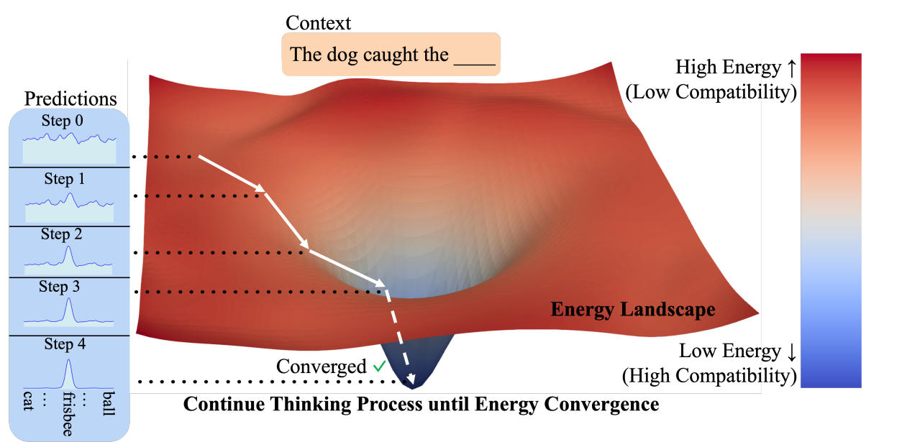

# Energy-Based Transformers are Scalable Learners and Thinkers

**Year:** 2025

**Paper:** [arXiv](https://arxiv.org/pdf/2507.02092)

**Code:** [GitHub](https://github.com/alexiglad/ebt)

## ✏️ Summary

**Concept:** Energy-Based Transformers (EBTs) are a type of Energy-Based Models that assign an energy value to each input-prediction pair, with lower energy for higher compatible pair. Predictions are generated by iterative energy minimization until convergence.

**Thinking process:** 1) Start with a random output, 2) At each step, compute energy of input and current output, compute gradients, and update the output by gradient descent. 3) Repeat until energy converges.

**Learning:** EBMs unify verifier and generator in one model. The verifier evaluates compatibility in the forward pass, while its gradients implicitly define the generator in the backward pass.

**Benefits:** 1) Dynamic computation allocation – the number of steps adapts to task complexity. 2) Uncertainty modeling – energy values serve as unnormalized likelihoods over predictions. 3) Verification – energy itself acts as a learned verifier of prediction quality.

**Inference:** 1) Sample multiple random initial outputs. 2) Run iterative energy minimization for each. 3) Select the one with lowest final energy.

**Architecture:** Transformer as the energy function with two variants, decoder-only and bidirectional.

## 🏷️ Topics
`Energy`
