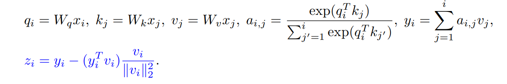

# Exclusive Self Attention

**Year:** 2026

**Published by:** Apple

**Paper:** [arXiv](https://arxiv.org/pdf/2603.09078)

## ✏️ Summary
**Background:**
In Transformers, layers alternate between self-attention (SA), which aggregates contextual information from other tokens, and feed-forward networks (FFN), which update each token’s representation independently.

**Attention Similarity Bias:**
Standard SA outputs tend to be highly aligned with the token’s own value vector, meaning the layer reuses information already present at that position. This creates redundancy with the FFN (which already handles token-wise features) and weakens SA’s main role of modeling contextual interaction with other tokens.

**Exclusive Self-Attention (XSA):**
XSA modifies SA by removing the component of the attention output that aligns with the token’s own value vector, forcing the layer to focus only on orthogonal (contextual) information. This reduces redundancy and improves sequence modeling by better separating the roles of SA (context) and FFN (representation).

## 🏷️ Topics
`LLM`
