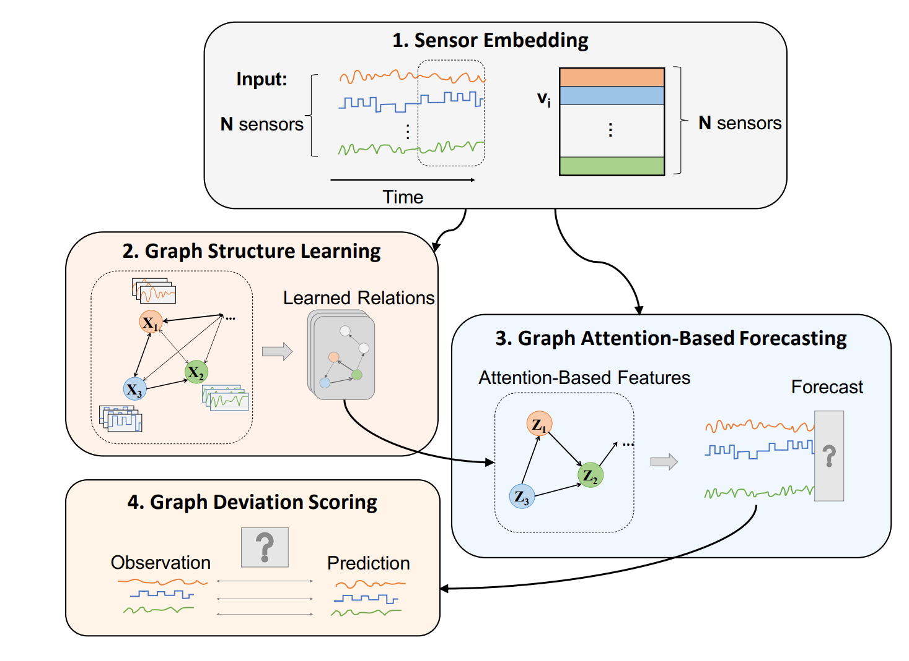

# GDN: Graph Neural Network-Based Anomaly Detection in Multivariate Time Series

**Year:** 2021

**Paper:** [arXiv](https://arxiv.org/pdf/2106.06947)

**Code:** [GitHub](https://github.com/d-ailin/GDN)

## 🧠 Summary
Forecasting-based unsupervised multivariate time series anomaly detection using graph structure and attention. Graph structure is useful to learn relationships between features.

**Architecture:**

1. **Sensor embedding:** Capture unique characteristics of each sensor (similar features have similar embeddings).
2. **Graph structure learning:** Learn directed-graph representing dependence relationships between sensors. Using a similarity metric, find the top k similar embeddings of each sensor.
3. **Graph attention-based forecasting:** Using the graph, extract each sensor and its dependent neighbors with learned attention coefficients, multiply by the embedding, and input into fully-connected model to forecast future values.
4. **Graph deviation scoring:** Compute differences to identify deviations from the learned relationships using robust normalization per sensor and anomaly threshold.

Note: only normal data are used at training.

**Highlights:**

* Graph structure can be used to learn relationships between features
* Normalization of anomaly score per feature

## 🏷️ Topics
`Anomaly`
