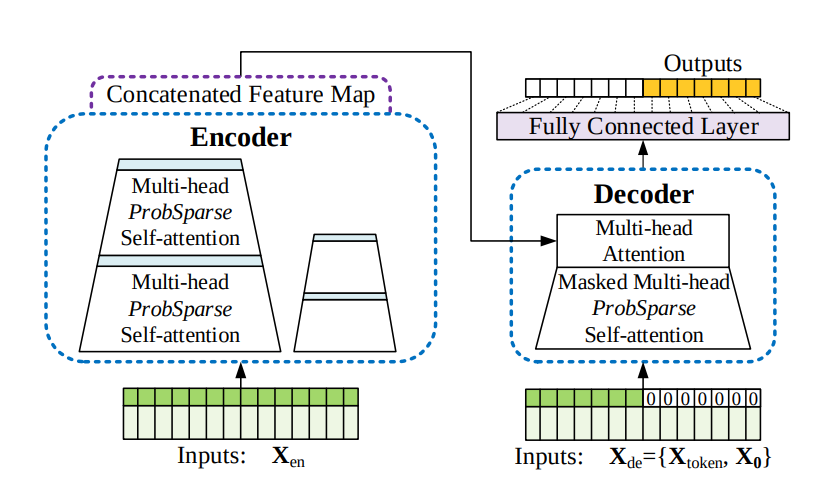

# Informer: Beyond Efficient Transformer for Long Sequence Time-Series Forecasting

**Year:** 2021

**Paper:** [arXiv](https://arxiv.org/pdf/2012.07436)

**Code:** [GitHub](https://github.com/zhouhaoyi/Informer2020)

## ✏️ Summary
A Transformer-based model for long sequence time-series forecasting:

* Canonical self-attention is computationally and memory intensive, even though only a few queries contribute most of the attention. **ProbSparse self-attention** improves efficiency by selecting only the most important queries with sharp attention distributions, using a sparsity measure. A randomly sampled subset is used to approximate this sparsity without computing all dot-products.

* Although ProbSparse reduces redundant queries, it can still generate redundant value combinations. The encoder applies a **distilling operation**, including 1D convolution, ELU activation and MaxPooling, to preserve dominant attention patterns while reducing sequence length. Outputs from all downsampled encoder stacks are concatenated into a final representation.

* The decoder input consists of a past sequence followed by a zero-filled placeholder for the target. Using masked ProbSparse attention, the model predicts the entire output sequence in a **single forward pass**, enabling fast and efficient long-range forecasting compared to traditional slow auto-regressive decoding.

## 🏷️ Topics
`FM`, `Multi-Horizon`
