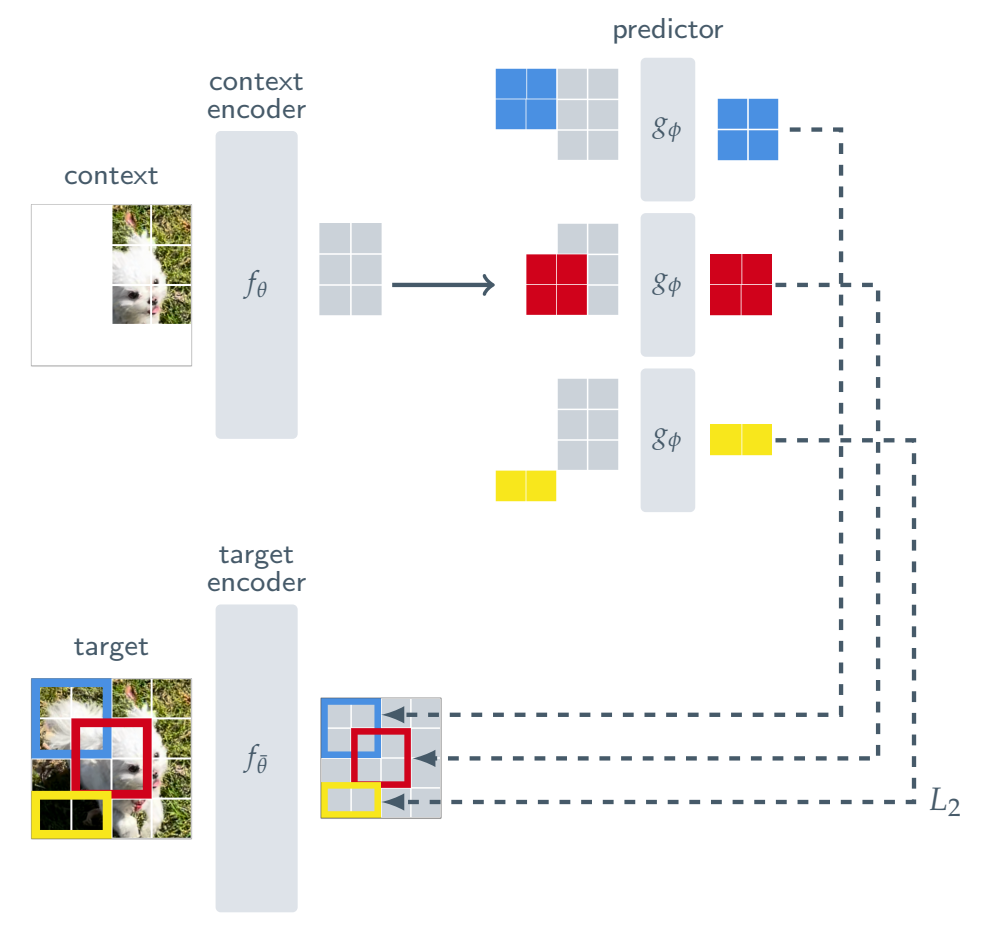

# JEPA: Self-Supervised Learning from Images with a Joint-Embedding Predictive Architecture

**Year:** 2023

**Published by:** Meta

**Paper:** [arXiv](https://arxiv.org/pdf/2301.08243)

## ✏️ Summary

I-JEPA is a method for learning semantic image representations.

**Image representation approaches**

* Joint-embedding architectures: Invariance-based methods using image augmentation. Require domain knowledge and are harder to generalize to other modalities.
* Generative architectures: Reconstruction-based methods using masking. Need fine-tuning for downstream tasks.
* Joint-embedding predictive architectures: Similar to generative approaches, but predict in embedding space rather than reconstruct raw pixels. Produce more semantic representations, train faster, and avoid reliance on augmentation priors.

**Idea**

Given a context block representation from an image, the model predicts the representations of multiple target blocks from the same image.
* *Image -> sampled context -> masking -> representation*
* *Image -> several sampled targets -> representations -> masking*

**Architecture**

Context-encoder, target-encoder, and predictor with positional embedding to predict the targets. All components use a vision transformer backbone.

**Training**

* Loss: MSE
* Optimization: Gradient-based optimization for context-encoder and predictor, and exponential moving average for target-encoder based on the context-encoder parameters (for stability).

**Evaluation**

To visualize predictions, a decoder can be trained to map learned representations back to pixel space.

## 🏷️ Topics
`CV`, `Representation`
