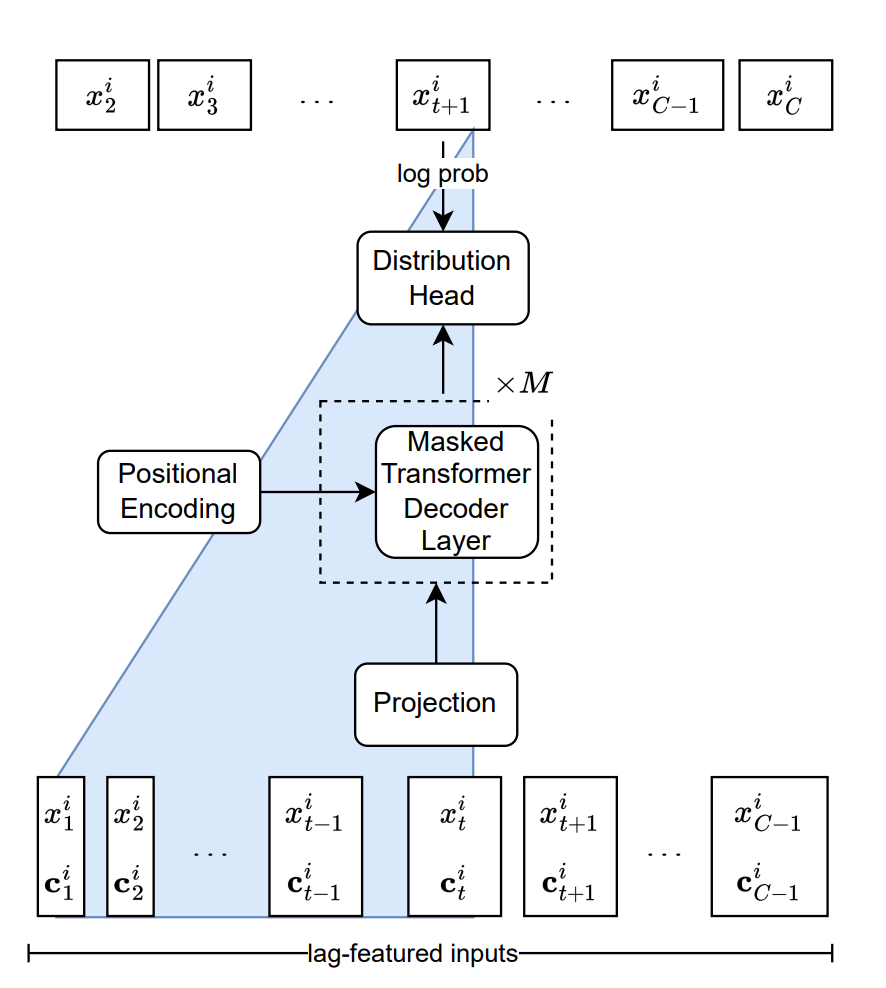

# Lag-Llama: Towards Foundation Models for Probabilistic Time Series Forecasting

**Year:** 2024

**Paper:** [arXiv](https://arxiv.org/pdf/2310.08278)

**Code:** [GitHub](https://github.com/time-series-foundation-models/lag-llama)

## ✏️ Summary
Foundation model for univariate probabilistic time series forecasting using a decoder-only transformer-based architecture.

**Preprocessing:** robust scaling of windows to handle the diversity in numerical magnitudes across different datasets.

**Input:** lagged features (history) + date time features (frequencies) + summary statistics (mean and variance used for scaling) as covariates.

**Output:** Student’s t-distribution parameters of the next time step(s), including degrees of freedom, mean and scale.

**Architecture:** tokens -> projection -> masked [ensures that each token can only attend to the previous tokens in the sequence, preventing information leakage from the future] decoder layers -> distribution head.

**Training:** minimizing the negative log-likelihood of the predicted distribution of all predicted timesteps. Freq-Mix and Freq-Mask technics are used for sampling and augmentation.

## 🏷️ Topics
`Covariates`, `FM`
