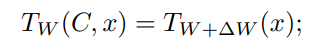

# Learning without training: The implicit dynamics of in-context learning

**Year:** 2025

**Published by:** Google

**Paper:** [arXiv](https://arxiv.org/pdf/2507.16003)

## ✏️ Summary

**Introduction**

* In‑context learning (ICL): The model’s ability to learn new patterns unseen during training from examples provided in the prompt.

* Contextual block: A combination of a contextual layer (e.g., self‑attention) with a neural network, applied to an input together with its context.

**Theorem**

A contextual layer implicitly transfers information from the prompt to the first neural network layer through a rank‑1 weight update, temporarily modifying the model’s behavior.

**Key findings**

* Equivalent predictions: The model’s predictions with the full in‑context prompt match those from the same model without the prompt but with its MLP weights adjusted based on the prompt.

* Context removal: Removing part of the context and applying the corresponding weight adjustment produces the same output as using the full prompt.

* Token‑level updates: Each token in the prompt contributes a small weight adjustment, similar to how online stochastic gradient descent updates weights incrementally using individual data points.

* Convergence: As more tokens are added, weight updates become smaller and eventually stop, showing convergence similar to gradient descent.

**Conclusion**

ICL works like fine‑tuning in weight space, helping explain how neural networks generalize so effectively to unseen patterns.

## 🏷️ Topics
`Context`, `LLM`
