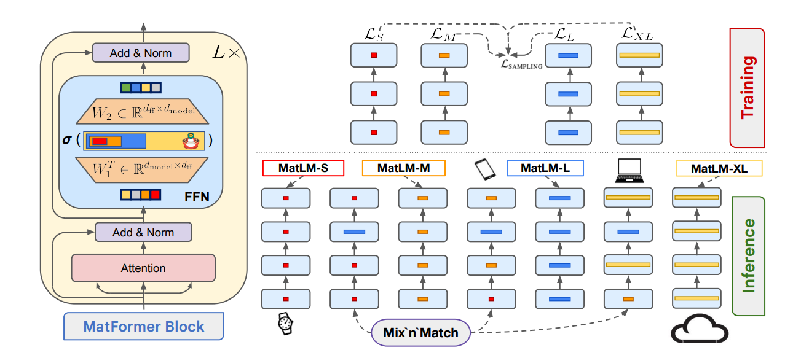

# MatFormer: Nested Transformer for Elastic Inference

**Year:** 2024

**Published by:** Google

**Paper:** [arXiv](https://arxiv.org/pdf/2310.07707)

**Code:** [GitHub](https://github.com/devvrit/matformer)

## ✏️ Summary

**Issue:** In most cases, only a few fixed model sizes are available, forcing to either use a smaller and lower-quality model or perform compression/finetuning that adds extra cost.

**Solution:** A single universal model that contains nested small submodels, enabling inference across diverse size constraints without requiring additional training cost.

**Structure:** Transformer block that contains a nested FFN that supports multiple granularities, such that every smaller submodel parameters are fully contained within the larger ones. Stacking these blocks constructs the complete model.

**Training:** At each step, a granularity is randomly sampled and optimized, enabling the model to jointly learn all configurations and produce multiple accurate and consistent submodels.

**Mix’n’Match:** Optimal combination of submodels with different granularities at inference time, generally preferring modest increases in layer width to enhance performance.

**Results:**

- The submodels act as lightweight draft models in *speculative decoding*, generating tokens that are then verified by the larger model; incorrect drafts are rolled back, enabling significant inference speed-up while preserving the large model’s accuracy.

- Different submodels can be used for *image retrieval*, as submodels of varying sizes preserve relative distances to a fixed database.

## 🏷️ Topics
`CV`, `LLM`
