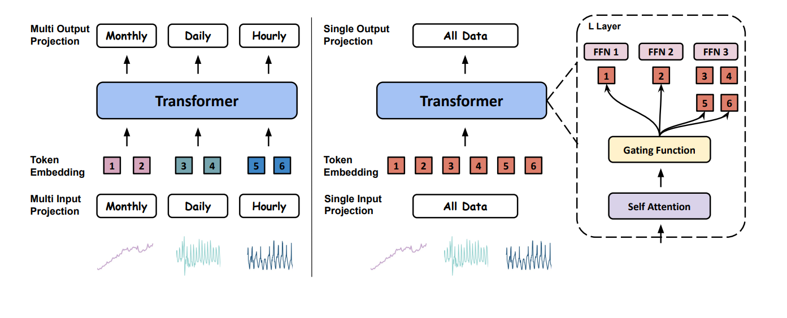

# Moirai-MoE: Empowering Time Series Foundation Models with Sparse Mixture of Experts

**Year:** 2024

**Published by:** Salesforce

**Paper:** [arXiv](https://arxiv.org/pdf/2410.10469)

## ✏️ Summary
Moirai-MoE is a foundation model for time-series forecasting that uses a Mixture-of-Experts (MoE) transformer architecture. Instead of separate components for different frequencies (as in [MOIRAI](moirai-unified-training-of-universal-time-series-forecasting-transformers.md)), it uses one shared projection and lets experts specialize at the token level to capture diverse patterns.

**Patching and Normalization:** Use the first portion of the patch sequence to compute normalization statistics, and exclude this portion from the training loss.

**Architecture:** A Transformer where the standard FFN is replaced with MoE.

**Gating Function:** Before training, use embeddings from a pretrained model to cluster tokens into several groups (representing patterns like trends, spikes, seasonality, etc.). During training, each cluster corresponds to an expert, and for every token, compute its distance to the cluster centroids and route the token to the closest experts.

## 🏷️ Topics
`FM`, `MoE`
