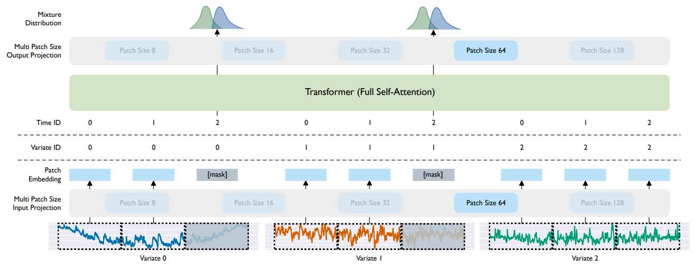

# MOIRAI: Unified Training of Universal Time Series Forecasting Transformers

**Year:** 2024

**Published by:** Salesforce

**Paper:** [arXiv](https://arxiv.org/pdf/2402.02592)

**Code:** [GitHub](https://github.com/SalesforceAIResearch/uni2ts)

## ✏️ Summary
Challenges for time series foundation models include handling variations in (1) sampling frequency, (2) number of features, and (3) distributional properties across domains. MOIRAI addresses all of them.

**Architecture**

- Flattened multivariate input: Flatten all variates into a single sequence, handling an arbitrary number of features without assuming variate independence or fixed dimensionality.

- Multi patch-size projection layers: Learn input and output projections with different patch sizes and select according to data frequency (larger patches for higher frequency).

- Masked future: Mask horizon segments during training.

- Any-variate attention: Use encoder-only transformer with (1) rotary position embeddings (RoPE) for temporal order within series, and (2) binary attention biases to mark if two tokens come from the same or different variate, enabling an arbitrary number of features.

- Mixture distribution output: Predict parameters of four distributions for flexible forecasting, including Student’s t, Negative binomial, Log-normal and Low-variance normal.

**Training**

- Normalization: Apply non-learnable instance normalization to inputs and outputs.

- Objective: Train by maximizing the log-likelihood of the predictive mixture distribution.

- Data distribution: Ensure balanced sampling across domains.

- Task distribution: Vary context length, forecast horizon and number of features.

## 🏷️ Topics
`Covariates`, `FM`, `Patching`, `Probabilistic`
