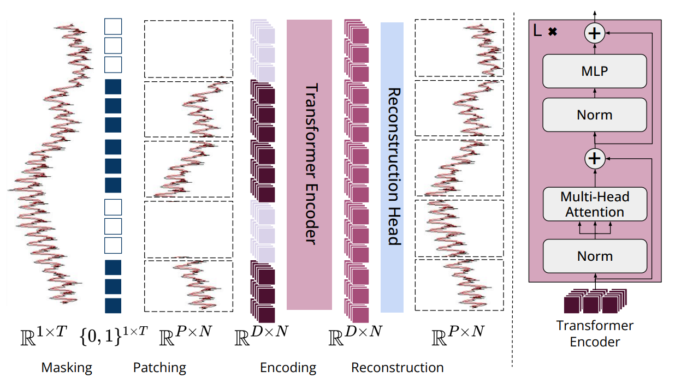

# MOMENT: A Family of Open Time-series Foundation Models

**Year:** 2024

**Paper:** [arXiv](https://arxiv.org/pdf/2402.03885)

**Code:** [GitHub](https://github.com/moment-timeseries-foundation-model/moment)

## ✏️ Summary
MOMENT is a univariate time series foundation model designed for short- and long-horizon forecasting, classification, anomaly detection and imputation.

- Pipeline: maskig -> patching -> transformer -> reconstruction (masked and unmasked)
- Input: fixed-length series (other lengths are padded or chunked)
- Positional encoding: both relative and absolute embeddings
- Multivariate support: operates independently on each univariate channel
- Prediction head: lightweight, optionally fine-tuned or replaced (e.g. forecasting head)

Highlight: MOMENT learns semantically meaningful representations - PCA of the embeddings reveals encoding of trend, scale and frequency.

## 🏷️ Topics
`Anomaly`, `FM`, `Patching`, `Representation`
