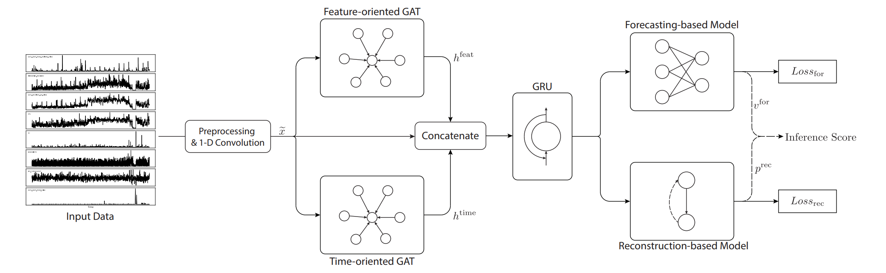

# MTAD-GAT: Multivariate Time-series Anomaly Detection via Graph Attention Network

**Year:** 2020

**Paper:** [arXiv](https://arxiv.org/pdf/2009.02040.pdf)

**Code:** [GitHub](https://github.com/ML4ITS/mtad-gat-pytorch)

## ✏️ Summary
**Preprocessing:**
- Normalization
- Cleaning using univariate Spectral Residual

**Architecture:**
- Convolutions to extract high-level features.
- Feature-oriented and time-oriented graph attentions to underline the relationships between multiple features and timestamps.
- GRU to capture sequential patterns.
- Forecasting-based model to predict the value at next timestamp using FC, and reconstruction-based model to capture data distribution of entire time-series using VAE.

**Inference:**
Anomalies are detected by high prediction/reconstruction errors, as if the model fails to reconstruct the current input or to forecast the next step, the data point is likely anomalous.

## 🏷️ Topics
`Anomaly`
