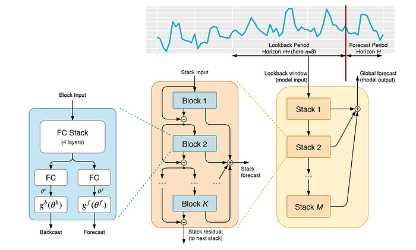

# N-BEATS: Neural Basis Expansion Analysis for Interpretable Time Series Forecasting

**Year:** 2020

**Published by:** Element AI

**Paper:** [arXiv](https://arxiv.org/pdf/1905.10437)

**Code:** [GitHub](https://github.com/ServiceNow/N-BEATS)

## ✏️ Summary
Task: univariate times series forecasting

**Basis functions:** Either learnable or problem-specific constrained. The constrained option enables interpretability, e.g., explicitly modeling trend or seasonality components.

**Block:** FC layers that predicts two sets of expansion coefficients, which are fed into two basis functions to generate Backcast (input approximation) and Forecast (future prediction).

**Stack:** Multiple blocks with two residual branches:

1. Backcast residual: Each block removes its backcast from the input, allowing subsequent blocks to focus on components not yet captured (e.g. removing trend before processing seasonality).

2. Forecast accumulation: Each block adds its forecast to the previous ones, yielding interpretable partial outputs (e.g. partial forecasts of trend and seasonality).

**Global model:** multiple stacks, with partial forecasts aggregated in a hierarchical manner.

## 🏷️ Topics
`Interpretable`
