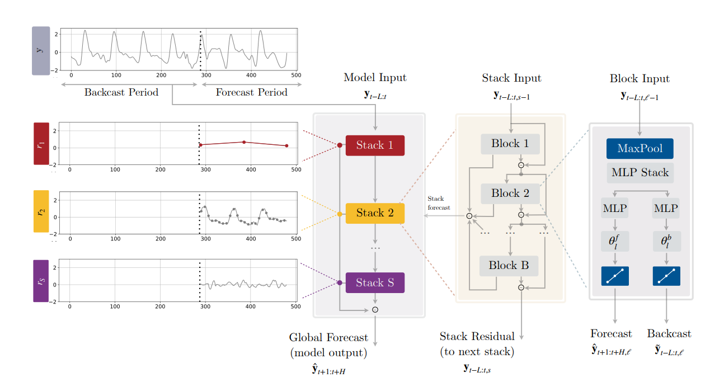

# N-HiTS: Neural Hierarchical Interpolation for Time Series Forecasting

**Year:** 2022

**Published by:** Nixtla

**Paper:** [arXiv](https://arxiv.org/pdf/2201.12886)

**Code:** [GitHub](https://github.com/Nixtla/neuralforecast/blob/main/neuralforecast/models/nhits.py)

## ✏️ Summary
A long-horizon forecasting model based on [N-BEATS](../papers/n-beats-neural-basis-expansion-analysis-for-interpretable-time-series-forecasting.md), designed to reduce computational requirements and improve forecasting accuracy.

**Multi-Rate Data Sampling:** Each block applies MaxPool to extract specific-scale components. Across the stack, the kernel size increases, filtering out more high-frequency patterns and focusing on lower-frequency trends.

**Hierarchical Interpolation:** Each block forecasts at a lower temporal resolution and uses interpolation to reconstruct the full horizon. Across the stack, the expressiveness ratio increases, enabling to capture more subtle details with less smoothed interpolation.

## 🏷️ Topics
`Interpretable`, `Multi-Horizon`
