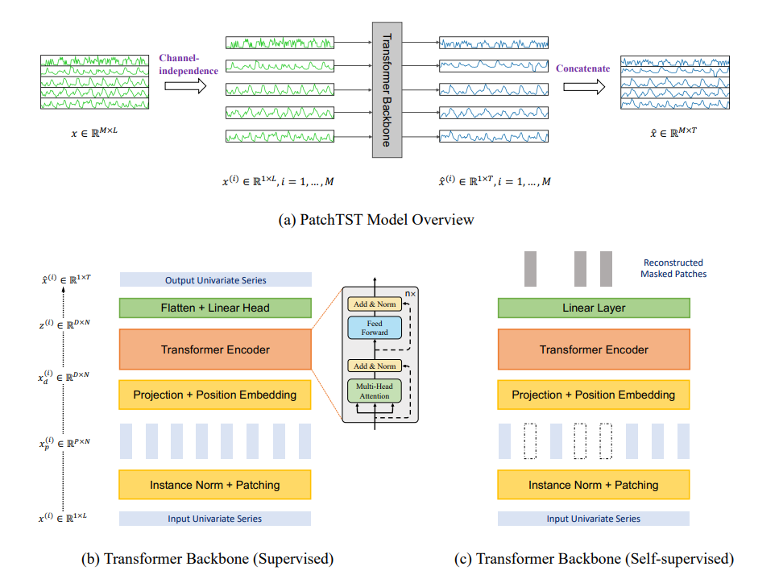

# PatchTST: A Time Series is Worth 64 Words - Long-term Forecasting with Transformers

**Year:** 2023

**Published by:** IBM

**Paper:** [arXiv](https://arxiv.org/pdf/2211.14730)

**Code:** [GitHub](https://github.com/yuqinie98/PatchTST)

## ✏️ Summary
PatchTST is a transformer-based model designed for multivariate time series forecasting and representation learning.

**Key components:**

- **Patching**: Each univariate time series is divided into fixed-length subseries (using `patch_len` and `stride`), resulting in a shape of `(batch, num_patches, patch_len)`. Each patch acts as a token input to the transformer. Benefits include:
    - Retention of local semantic information for rich representations
    - Quadratic reduction in attention computation and memory (compared to token-per-timestep)
    - Ability to attend to longer histories for improved long-term modeling

- **Channel-independence:** Each univariate time series (channel) is processed independently, with shared embedding and Transformer weights across all series.

**Use cases:**
- Multi-horizon forecasting
- Self-supervised representation learning via masked patch reconstruction

## 🏷️ Topics
`Patching`, `Representation`
