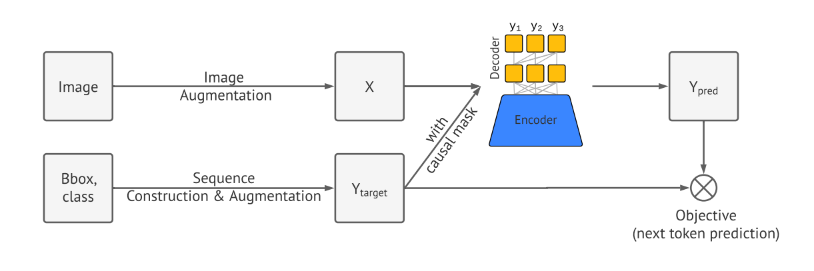

# Pix2seq: A Language Modeling Framework for Object Detection

**Year:** 2022

**Published by:** Google

**Paper:** [arXiv](https://arxiv.org/pdf/2109.10852)

**Code:** [GitHub](https://github.com/google-research/pix2seq)

## ✏️ Summary

Pix2Seq treats object detection as an image-conditioned sequence-generation task, representing each object through discrete bounding-box and class tokens. The core intuition is that once the network has learned what objects are present and where they are located, it only needs to learn how to express that knowledge as a token sequence.

Compared with other object-detection methods, which rely on highly specialized architectures and losses such as region proposals, object queries, and box regression, Pix2Seq introduces minimal task-specific prior knowledge, making the framework simpler and easier to adapt to other domains and tasks.

### Framework

**Image augmentation:** Enrich a fixed set of training images.

**Sequence construction:** Convert object annotations, represented as a set of bounding boxes and class labels, into a sequence of discrete tokens. The vocabulary contains uniformly quantized coordinate bins and separate tokens for all object classes. Each object is represented by five tokens: four bounding-box coordinates and one class label. The objects are randomly ordered each time an image is shown, avoiding an artificial ordering rule and encouraging the model to predict any remaining valid object. An `EOS` token marks the end of the sequence.

**Architecture:** Use an encoder-decoder model, where the encoder perceives pixel inputs and encodes them into hidden representations, and the decoder generates the target sequence one token at a time using a softmax, conditioned on the encoded image and the previous tokens.

**Objective:** Maximize the log-likelihood of tokens conditioned on the image and the preceding tokens with a softmax cross-entropy loss across all tokens (with weights optionally assigned to different token types).

**Inference:** Starting from `BOS`, generate tokens autoregressively using either argmax decoding or nucleus sampling, until `EOS` is produced.

### Prior Knowledge

**Problem:** Model may generate `EOS` before detecting all objects, especially because of missing annotations or uncertainty around difficult objects. Delaying `EOS` improves recall, but without additional training it also creates duplicate and noisy detections.

**Sequence augmentation:** During training, synthetic objects are appended after the real objects. They are created either by perturbing ground-truth boxes or by generating random boxes with random class labels. This injects detection-specific prior knowledge by explicitly teaching the model how to recognize invalid and duplicate proposals.

**Input and target sequences:** The input sequence contains both real and synthetic objects. For each synthetic object, the target class is changed to a special `noise` token. Its four coordinate targets are marked `n/a`, and their loss weights are set to zero, because the model should identify the candidate as noise rather than reproduce its coordinates.

**Altered inference:** `EOS` is delayed, forcing the model to generate a fixed number of candidate objects and giving uncertain objects additional chances to be detected. Predicted `noise` labels are then replaced with the most likely real class, whose probability is used as the confidence score.

### Results

* Pix2Seq performs competitively with more task-specific object-detection methods.

* When predicting the first coordinate of a new object, the decoder attends broadly across the image. As additional coordinate tokens are generated, the attention becomes concentrated on the relevant object, helping the model complete the bounding box and predict its class.

## 🏷️ Topics
`CV`, `LLM`
