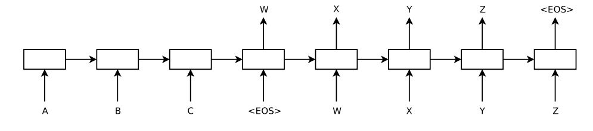

# Sequence to Sequence Learning with Neural Networks

**Year:** 2014

**Published by:** Google

**Paper:** [arXiv](https://arxiv.org/pdf/1409.3215)

## ✏️ Summary

**Issue:** Standard DNNs require fixed-size inputs and outputs, so they cannot naturally handle variable-length sequence-to-sequence tasks such as translation.

**Solution:** Use an encoder LSTM to compress the input sequence into a fixed-size vector, then use a decoder LSTM, conditioned on this vector, to generate the output sequence one token at a time.

**Training and Decoding:** Each word is predicted using a softmax over the vocabulary, and generation ends when the decoder produces the `EOS` token, allowing input and output sequences to have different lengths. During inference, it generates translations from left to right using beam search, which keeps several of the most likely partial sequences at each step and repeatedly expands them.

**Reversing the Source Sentences:** The source sentence was reversed while the target sentence remained in its original order. This brought corresponding source and target words closer together, creating shorter dependencies, simplifying optimization, and enabling the LSTM to perform well even on long sentences.

**Learned Representations:** The encoder mapped variable-length sentences into fixed-dimensional vectors that captured their meaning, placing semantically similar sentences close together while remaining sensitive to word order and relatively invariant to changes between active and passive voice.

## 🏷️ Topics
`LLM`
