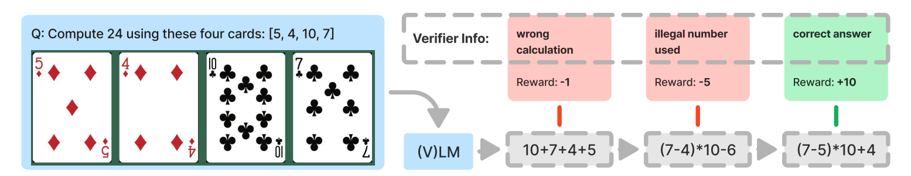

# SFT Memorizes, RL Generalizes: A Comparative Study of Foundation Model Post-training

**Year:** 2025

**Published by:** Google

**Paper:** [arXiv](https://arxiv.org/pdf/2501.17161)

**Code:** [GitHub](https://github.com/LeslieTrue/SFTvsRL)

## ✏️ Summary

This paper studies the effect of post-training techniques - supervised fine-tuning (SFT) and reinforcement learning (RL) - on generalization and memorization, focusing on text-based and visual reasoning tasks.

**Setup:** first, apply SFT to a pretrained model, then perform multi-step RL with sequential revision, where each step receives the outputs and verification signals (rewards) from all previous steps.

**Results:**

- RL generalizes well to out-of-distribution tasks, whereas SFT tends to memorize training data and struggles to generalize.

- RL improves the model’s underlying visual recognition capabilities, leading to better generalization in visual tasks.

- SFT is still helpful for effective RL training because it stabilizes the model’s output format, enabling RL to achieve stronger performance gains.

- Increasing the number of verification steps further improves generalization.

## 🏷️ Topics
`CV`, `FM`, `LLM`
