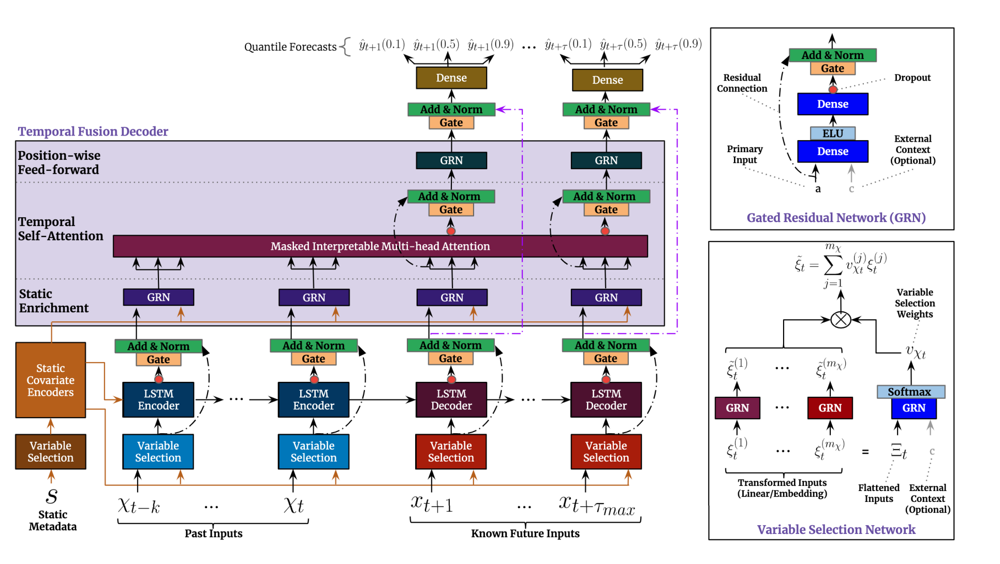

# TFT: Temporal Fusion Transformers for Interpretable Multi-horizon Time Series Forecasting

**Year:** 2020

**Published by:** Google

**Paper:** [arXiv](https://arxiv.org/pdf/1912.09363)

## ✏️ Summary
- **LSTM-based Encoder:** capture sequential dependencies.
- **Static and Time-dependent Variable Selection Layer:** prioritize past, future and static covariates most relevant for temporal changes.
- **Gating Mechanisms for Robustness:** control the influence of each feature or time step.
- **Temporal Attention Layer:** focus on specific time steps within the historical data, effectively handling long-range dependencies without relying on a fixed-size window.
- **Multi-head Attention:** weigh and focus on different aspects of the data. The attention mechanisms highlight which features are influencing the forecast most significantly, enabling interpretability.
- **Prediction Intervals:** produce probabilistic forecasts by estimating prediction intervals across multiple future time steps at once.

## 🏷️ Topics
`Covariates`, `Probabilistic`, `Static`
