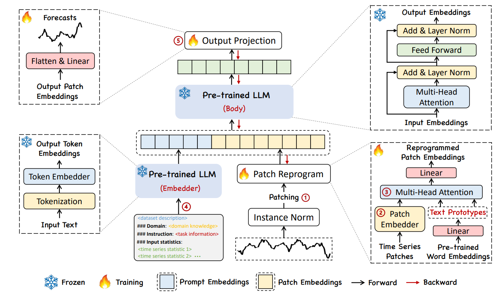

# Time-LLM: Time Series Forecasting by Reprogramming Large Language Models

**Year:** 2024

**Paper:** [arXiv](https://arxiv.org/pdf/2310.01728)

**Code:** [GitHub](https://github.com/KimMeen/Time-LLM)

## ✏️ Summary

TIME-LLM translates time series data into language tokens and uses a frozen LLM to perform forecasting.

**Preprocessing**
- Instance normalization
- Tokenization via patching for better preserving local semantic information
- Patch embedding

**Patch Reprogramming**
- Linearly map pre-trained word embeddings into a small collection of time-series–related text prototypes (e.g., "short up", "steady down").
- Use a multi-head cross-attention layer to represent each time-series patch in terms of these language tokens.

**Prompt-as-Prefix**
- Feed dataset context, task instruction and input statistics into a frozen pre-trained LLM embedder.

**Output**
- Concatenate prefixes with reprogrammed patches and input them into a frozen pre-trained LLM.
- Project the results through a learnable output layer.

## 🏷️ Topics
`FM`, `LLM`, `Patching`
