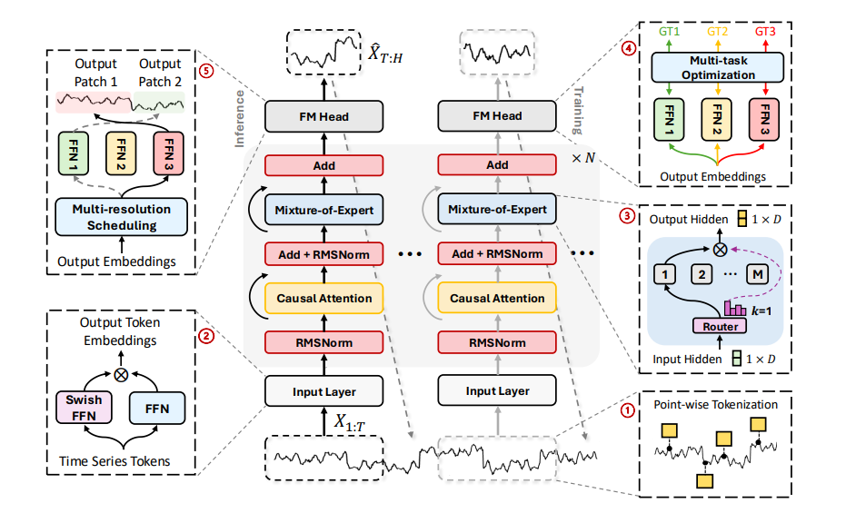

# Time-MoE: Billion-Scale Time Series Foundation Models with Mixture of Experts

**Year:** 2025

**Paper:** [arXiv](https://arxiv.org/pdf/2409.16040)

**Code:** [GitHub](https://github.com/Time-MoE/Time-MoE)

## 🧠 Summary
In traditional dense models, all parameters are activated. In contrast, a sparse Mixture-of-Experts (MoE) model consists of multiple specialized "expert" networks, and when an input is processed, a "router" directs the data to specific experts which are most relevant to that particular input.

TIME-MoE is a time series forecasting foundation model family that leverages a sparse design with Mixture-of-Experts to enhance inference computational efficiency while maintaining an effective scalable model (2.4 billion parameters). It comprises decoder-only transformer models operating autoregressively to support any forecasting horizon during inference using different forecasting heads.

Interestingly, in different domains, different experts are used across layers.

## 🏷️ Topics
`FM`, `MoE`
