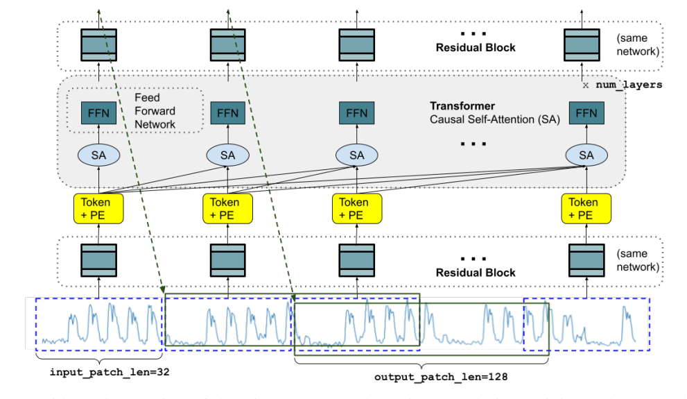

# TimesFM: A decoder-only foundation model for time-series forecasting

**Year:** 2024

**Published by:** Google

**Paper:** [arXiv](https://arxiv.org/pdf/2310.10688)

## ✏️ Summary
Motivated by recent advances in LLMs, TimesFM is a time-series forecasting foundation model whose out-of-the-box zero-shot performance comes close to the accuracy of state-of-the-art supervised forecasting models. It is built on a decoder-style attention architecture trained with input patching over a large and diverse time-series corpus, including both real-world and synthetic data. TimesFM handles varying forecasting horizons through an autoregressive approach: it predicts the base horizon and then concatenates these predictions to the input for forecasting subsequent horizons.

## 🏷️ Topics
`FM`
