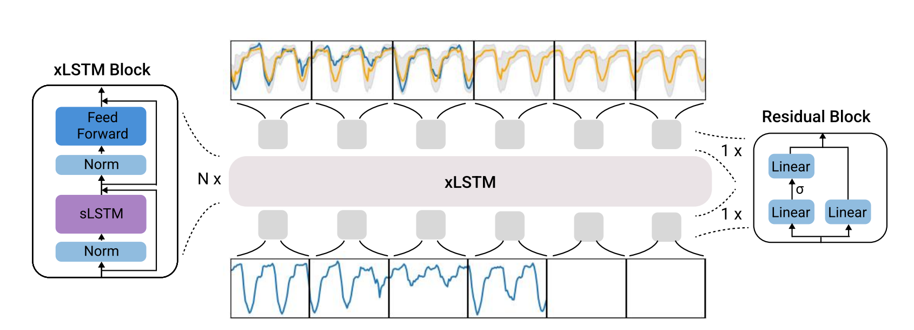

# TiRex: Zero-Shot Forecasting Across Long and Short Horizons with Enhanced In-Context Learning

**Year:** 2025

**Paper:** [arXiv](https://arxiv.org/pdf/2505.23719)

**Code:** [GitHub](https://github.com/NX-AI/tirex)

## ✏️ Summary

* Input: Univariate time series.
* Augmentation: Enhances the model's sensitivity to trends and rare events.
* Scaling and Patching.
* Contiguous Patch Masking (CPM): Randomly masks full consecutive patches during pre-training and treats them as missing values. Enables in-context learning, allowing the model to adapt to new tasks using only context provided at inference time, without updating its parameters (essential for zero-shot forecasting).
* Binary Masking: Handles missing values, for example, for prediction of multi-horizon target instead of auto-regressive prediction.
* Residual Block: Projects input to a constant embedding dimension.
* [xLSTM](xlstm-extended-long-short-term-memory.md) Blocks: Uses sLSTM (multi-head design) to retain state-tracking.
* Residual Block + Descaling.
* Quantile Outputs: Predicts multiple quantiles per time step, capturing conditional distribution and uncertainty.

## 🏷️ Topics
`FM`, `Patching`, `Probabilistic`
