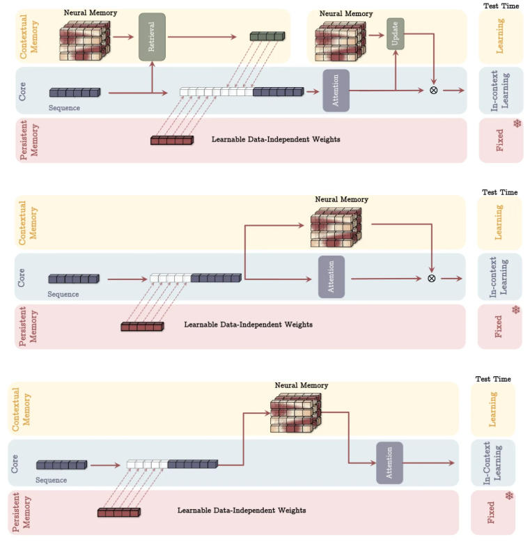

# Titans: Learning to Memorize at Test Time

**Year:** 2024

**Published by:** Google

**Paper:** [arXiv](https://arxiv.org/pdf/2501.00663)

## ✏️ Summary
**Limitations of current models:** RNNs compress the data into a fixed-size hidden state, risking info loss. Transformers capture the full context but have a quadratic cost that limits the context length.

**Mechanism:** To enable memorization without overfitting, Titans use gradient descent (momentary surprise), momentum (past surprise), and a forgetting mechanism.

**Training:**

- Inner loop learns associations by projecting inputs into key-value pairs and updating memory weights dynamically.
- Outer loop optimizes the rest of the architecture.

**Architecture:**

- Short-term memory: attention layer with limited context but accurate dependency modeling.
- Long-term memory: MLP capable of memorizing information across time.
- Persistent memory: task-specific knowledge embedded into the input.

**Variants:**

- Memory as a context (using segmentation)
- Memory as a gate (using sliding-window attention)
- Memory as a layer (using sliding-window attention)
- Memory as a layer without attention

## 🏷️ Topics
`FM`, `Static`
