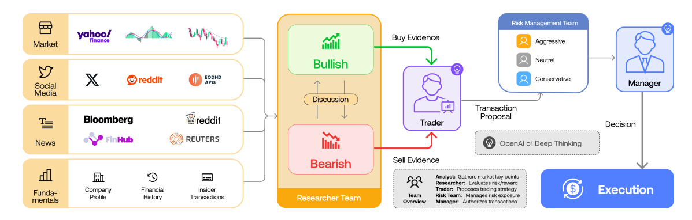

# TradingAgents: Multi-Agents LLM Financial Trading Framework

**Year:** 2025

**Paper:** [arXiv](https://arxiv.org/pdf/2412.20138)

**Code:** [GitHub](https://github.com/TauricResearch/TradingAgents)

## ✏️ Summary
A multi-agent LLM framework for financial trading that decomposes decision-making into specialized roles to better mimic real-world investment workflows. Instead of relying on a single model, the system aggregates diverse signals and uses structured debate to surface conflicting views before synthesizing a final action (buy/sell/hold). This improves performance while providing a more interpretable architecture.

1. **Analyst Team:** Collects and analyzes market data, including market trends, social media, news, and company financials.

2. **Researcher Team:** Debates investment hypotheses from both bullish and bearish perspectives.

3. **Trader Agents:**: Evaluate the evidence and propose trading decisions.

4. **Risk Management Team:** Assesses risk exposure and provides constraints or recommendations.

5. **Fund Manager:** Reviews the full discussion and makes the final decision.

## 🏷️ Topics
`Agent`, `LLM`
