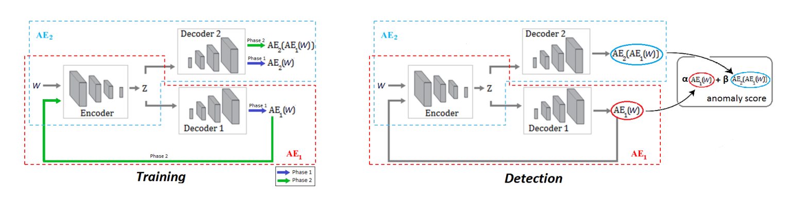

# USAD: UnSupervised Anomaly Detection on Multivariate Time Series

**Year:** 2020

**Paper:** [ACM Digital Library](https://dl.acm.org/doi/pdf/10.1145/3394486.3403392)

## ✏️ Summary
Reconstruction-based unsupervised multivariate time series anomaly detection using AE and GAN.

**Architecture:** Two autoencoders with the same encoder.

**Training:** Only normal data are used at training. Both AEs aim to reconstruct the input window. Also, AE1 seeks to fool AE2 and AE2 aims to learn when the data are real (input) or reconstructed (AE1’s output). The second part of the loss weights more as epoch increases.

**Intuition:** When the input data are different from the learned data distribution, the discriminator (AE2) considers it as coming from the generator (AE1) and classifies it as fake, i.e., as an anomaly.

## 🏷️ Topics
`Anomaly`
