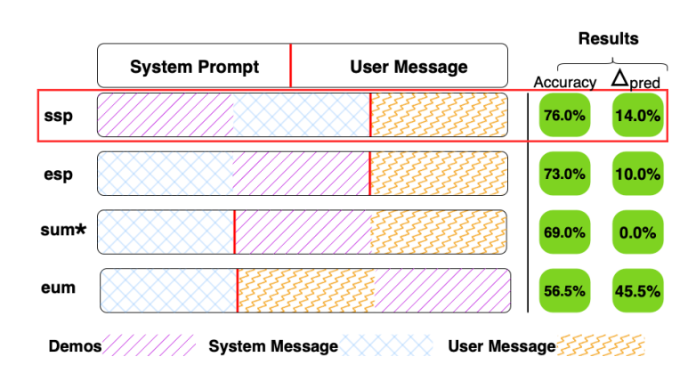

# Where to show Demos in Your Prompt: A Positional Bias of In-Context Learning

**Year:** 2025

**Paper:** [arXiv](https://arxiv.org/pdf/2507.22887)

## ✏️ Summary

**Demos’ Position in Prompt (DPP) bias:** In in-context learning, the same demonstrations can yield very different results depending solely on their position in the prompt. The paper compares four demo placements and evaluates their effect on performance.

**Configurations:** Start of the system prompt, end of the system prompt, start of the user message, and end of the user message.

**Evaluation Metrics:**

* Accuracy change: Performance difference compared to zero-shot.
* Prediction change: Percentage of predictions that change when demo position changes (instability).

**Findings:**

* Placing demos early in the prompt is usually best.
* Smaller models are more sensitive to demo position.
* There is no universally optimal position - prompt layout should be tuned per model and task.

**Reasons:**
* Architecture: In causal LLMs, early tokens influence all subsequent predictions, so position affects the hidden state.
* Data: Training data follows common prompt structures, leading models to learn positional priors.

## 🏷️ Topics
`ICL`, `LLM`
