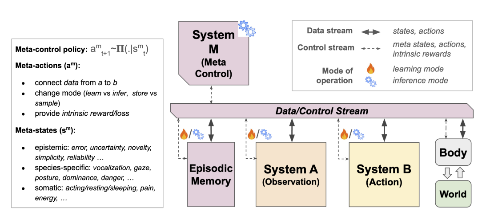

# Why AI systems don't learn and what to do about it

**Year:** 2026

**Published by:** Meta

**Paper:** [arXiv](https://arxiv.org/pdf/2603.15381)

## ✏️ Summary

Current AI depends heavily on humans for learning, while truly autonomous AI should continuously learn and adapt from its own experience after deployment.

Real intelligence needs two core learning modes:

* **System A** learns by observing data. It excels at recognizing patterns, building abstract representations, and scaling to massive datasets. However, it relies heavily on curated data, has limited grounding in the real world, and often confuses correlation with causation.
* **System B** learns through interaction and trial-and-error. It is effective at learning causal effects and goal-directed behavior, but it is often inefficient, expensive to train, and challenged by sparse rewards and difficult exploration.

Learning modes can complement each other: a strong world model helps an agent act more intelligently and reduce exploration cost, while actions provide informative data that cannot be obtained through passive observation alone.

**System M** introduces meta-control for autonomous learning. It decides how and when the agent should learn, act, explore, plan, and use memory, while coordinating information flow between observation-based learning (System A), action-based learning (System B), memory, and the environment, similar to how humans learn and adapt.

Evolutionary-Developmental Framework: Similar to biological organisms, AI should combine an outer evolutionary optimization process that learns useful priors (e.g., architecture, initialization, and meta-controller) with an inner developmental process in which the agent learns and adapts from experience throughout its lifetime. This approach enables continuous autonomous learning and adaptation.

## 🏷️ Topics
`Agent`, `LLM`
