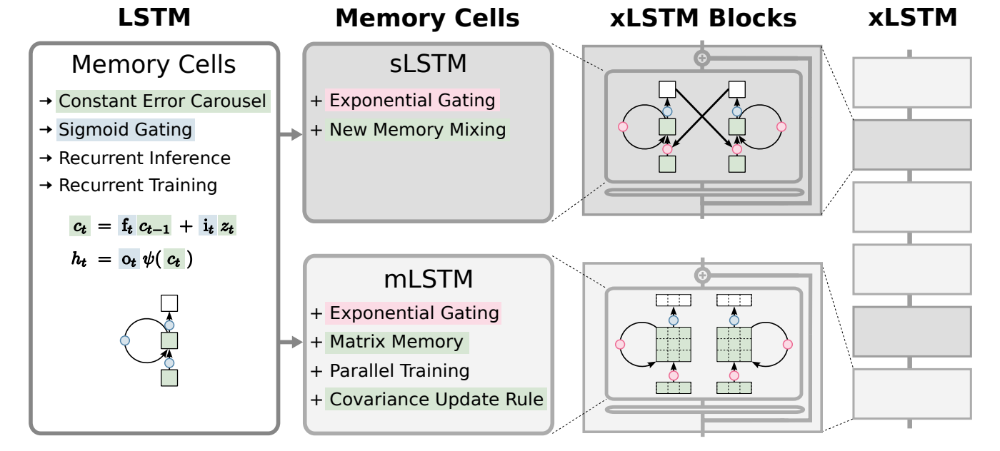

# xLSTM: Extended Long Short-Term Memory

**Year:** 2024

**Published by:** NXAI

**Paper:** [arXiv](https://arxiv.org/pdf/2405.04517)

**Code:** [GitHub](https://github.com/NX-AI/xlstm)

## ✏️ Summary
| LSTM Limitation | xLSTM Improvment |
|-----------------|----------------|
| Missing useful long-term memory | Exponential gating to avoid vanishing gradients |
| Limited memory using scalar cell states | Richer matrix memory | 
| Sequential processing | Full parallelization via covariance update rule |

**sLSTM**
* Exponential activation for input and forget gates to avoid vanishing gradients (since exponential gradients stay large)
* Normalization and stabilization to prevent overflow
* Scalar memory and scalar recursive update
* Multiple memory cells grouped into heads, with memory mixing within each head but not across heads

**mLSTM**
* Exponential gating
* Matrix memory instead of scalar memory 
* Covariance update rule using key–value–query mechanism, enabling parallelization (no hidden-to-hidden state recurrence, but full history processed at once like in transformers)

**xLSTM**
* sLSTM and mLSTM blocks
* Projection to a higher-dimensional space to better separate contexts or situations

## 🏷️ Topics
`Memory`
